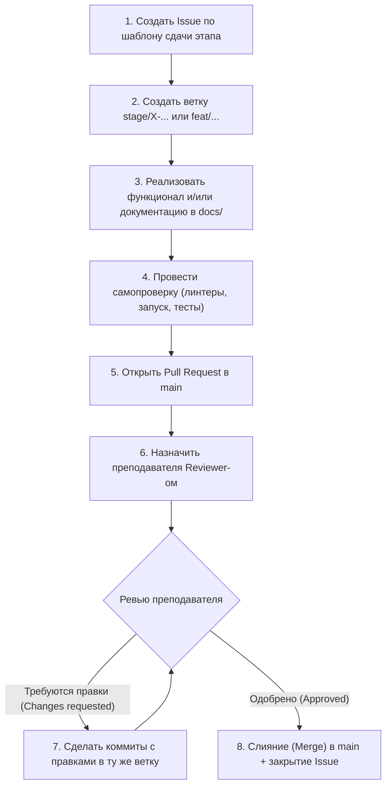

# Регламент разработки и сдачи выпускного проекта (Диплома)

Данный документ описывает правила работы с репозиторием, модель ветвления, стандарты оформления коммитов и процедуру сдачи этапов дипломного проекта для студентов **3 и 5 курса** курсов программирования.

Соблюдение данного регламента является **обязательным требованием** для всех студентов.

---

## 🚫 1. Главное правило

> **ПРЯМОЙ ПУШ В ВЕТКУ `main` КАТЕГОРИЧЕСКИ ЗАПРЕЩЁН!**
> 
> Ветка `main` находится под защитой (Branch Protection Rule). Слияние любых изменений в `main` возможно **исключительно** через Pull Request после обязательного код-ревью и получения статуса **Approve** от преподавателя.

---

## 🌿 2. Модель ветвления (Git Flow для проекта)

Все работы ведутся в отдельных тематических ветках, создаваемых от актуального состояния ветки `main`:

### Структура веток:
- `main` — стабильная версия проекта. Содержит только утвержденные преподавателем результаты этапов.
- `feat/<название>` — разработка новой функциональности (например: `feat/user-auth`, `feat/parser-engine`).
- `fix/<название>` — исправление ошибок или замечаний преподавателя (например: `fix/db-connection-pool`, `fix/typos-ch2`).
- `docs/<название>` — написание разделов документации и пояснительной записки (например: `docs/chapter1-analysis`, `docs/uml-diagrams`).
- `stage/<номер>-<название>` — сводная ветка для подготовки и сдачи этапа (например: `stage/01-spec-and-analysis`, `stage/02-mvp-prototype`).
- `chore/<название>` — технические работы, настройка CI/CD, линтеров, сборки.

### Правило создания ветки:
```bash
# Всегда начинайте с актуальной ветки main
git checkout main
git pull origin main

# Создание новой ветки
git checkout -b feat/user-auth
```

---

## 📝 3. Стандарт сообщений коммитов (Conventional Commits)

Все сообщения коммитов должны соответствовать спецификации [Conventional Commits](https://www.conventionalcommits.org/ru/v1.0.0/).

### Формат сообщения:
```text
<тип>[необязательный контекст]: <краткое описание в повелительном наклонении>

[необязательное подробное тело коммита]

[необязательный футер: ссылки на Issue]
```

### Основные типы коммитов:
| Тип | Назначение | Пример |
| :--- | :--- | :--- |
| `feat` | Добавление новой функциональности | `feat(api): реализовать эндпоинт авторизации JWT` |
| `fix` | Исправление ошибки | `fix(auth): исправить валидацию времени жизни токена` |
| `docs` | Изменения в документации / пояснительной записке | `docs(ch1): добавить обзор аналогов и сравнительную таблицу` |
| `refactor`| Рефакторинг кода без изменения логики | `refactor(db): вынести запросы в отдельный репозиторий` |
| `test` | Добавление или исправление тестов | `test(api): добавить модульные тесты для сервиса заказов` |
| `chore` | Обновление зависимостей, скриптов сборки | `chore(deps): обновить версию pydantic до 2.6` |
| `style` | Форматирование кода (отступы, точки с запятой) | `style: применить форматирование ruff/black` |

### ❌ Антипримеры (так делать нельзя):
- `коммит`, `fix`, `asdasd`, `update`
- `поправил кое-что`
- `сдал 1 главу`

### ✅ Правильные примеры:
- `feat(crawler): реализовать асинхронный сбор данных с пагинацией`
- `docs(intro): сформулировать цель, задачи и требования к проекту`
- `test(services): покрыть тестами расчет метрик качества модели`

---

## 🔄 4. Порядок сдачи контрольного этапа

Процесс сдачи каждого контрольного этапа состоит из следующих шагов:



### Пошаговые действия:

1. **Создание Issue:**
   В репозитории перейдите во вкладку `Issues` -> `New issue` -> выберите шаблон **«Сдача контрольного этапа»** (`01_stage.md`).

2. **Работа в ветке:**
   Создайте ветку под этап, выполняйте атомарные коммиты.

3. **Самопроверка перед открытием PR:**
   - [ ] Проект компилируется и поднимается локально через `docker compose up` без ошибок.
   - [ ] Отсутствуют временные файлы, дампы БД, `.env` с паролями.
   - [ ] Раздел документации в папке `docs/` оформлен в соответствии с требованиями.
   - [ ] Запущены линтеры и тесты.

4. **Создание Pull Request:**
   - Направьте PR из вашей ветки в ветку `main`.
   - Заголовок PR: `[Этап X]: <Краткое название этапа>` (например, `[Этап 1]: Анализ предметной области и архитектура`).
   - Заполните все разделы шаблона PR (он подставится автоматически).
   - В описании обязательно укажите ключевое слово для закрытия задачи: `Closes #<номер_issue>`.
   - В поле **Reviewers** укажите GitHub-аккаунт преподавателя.

5. **Работа с замечаниями (Code Review):**
   - Преподаватель оставляет комментарии к строкам кода или текста документации.
   - Не создавайте новый PR для правок! Добавляйте коммиты с исправлениями в ту же ветку и пушьте их (`git push origin <ветка>`). Pull Request обновится автоматически.
   - Отвечайте на комментарии преподавателя и отмечайте решенные треды (`Resolve conversation`).

6. **Слияние (Merge):**
   - После получения официального статуса **Approve** PR сливается в `main` (рекомендуется метод **Squash and merge** или **Rebase and merge** для сохранения чистоты истории).
   - Исходная ветка удаляется.
   - Связанный Issue закрывается автоматически.
